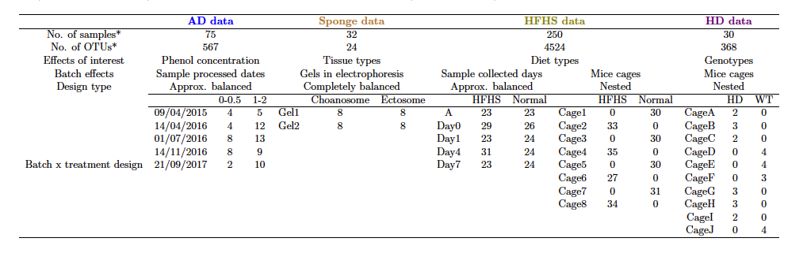
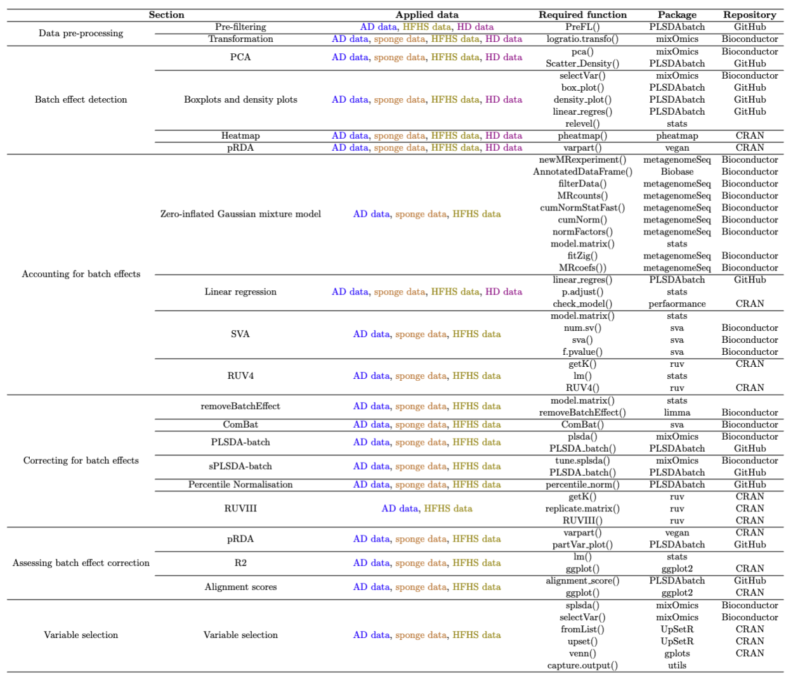

--- 
title: "PLSDA-batch: a multivariate framework to correct for batch effects in microbiome data"
author: |
  | Yiwen Wang$^{12}$, Kim-Anh Lê Cao$^2$
  | $^1$Agricultural Genomics Institute at Shenzhen, Chinese Academy of 
  | Agricultural Sciences, Shenzhen, Guangdong, China      
  | $^2$Melbourne Integrative Genomics, School of Mathematics
  | and Statistics, The University of Melbourne, Parkville, VIC, Australia
date: "`r Sys.Date()`"
site: bookdown::bookdown_site
documentclass: book
bibliography: [book.bib, packages.bib]
url: https://evayiwenwang.github.io/PLSDAbatch_workflow/
# cover-image: path to the social sharing image like images/cover.jpg
description: |
  Vignette for paper 'PLSDA-batch: a multivariate framework to correct for batch effects in microbiome data'.
link-citations: yes
github-repo: EvaYiwenWang/PLSDAbatch_workflow
---

# Batch Effects Management in Case Studies

```{r global_options, include = FALSE}
knitr::opts_chunk$set(dpi = 300, echo = TRUE, warning = FALSE, message = FALSE, 
                      error = FALSE, eval = TRUE, fig.show = TRUE, fig.width = 6, 
                      fig.height = 4, fig.align ='center', 
                      out.width = '60%', cache = FALSE)
```

## Introduction

Investigating the link between microbial composition and phenotypes has become the limelight of research in recent years, as microorganisms play a key role in extensive fields including agriculture, healthcare, food production, industry and climate change [@wang2020characterizing;@ray2020microbe;@fan2020gut;@poirier2020integrating]. The collection of microorganisms and their genomes within a specific environment is referred to as the *microbiome* [@marchesi2015vocabulary]. The microbiome can be profiled using 16S rRNA gene sequencing or whole-genome shotgun sequencing. The microbiome data is displayed as an abundance table of counts per sample for each taxon. This type of data have their inherent characteristics, including zero inflation, uneven library sizes, compositional structure, and multivariate nature, which limit statistical analysis.

Microbiome research faces the challenge of results reproducibility across studies. The potential reasons are poor experimental design and lack of rigorous operating procedures, which introduce variation in the data (batch effects) that obscure the effect of interest. Microbiome data are highly susceptible to batch effects because of the dynamic nature of microbial communities [@wang2020managing]. Numerous studies have reported batch effects introduced by sequencing batches [@hieken2016microbiome], the inclusion of independent studies [@duvallet2017meta], geography, age, sex, health status, stress and diet [@gibson2004dietary;@lozupone2013meta;@haro2016intestinal;@kim2017optimizing]. Attempts have been made to alleviate batch effects through standardised designs, but batch effects remain unavoidable in practice. For example, cage effects in murine experiments, age, sex and diet effects in human experiments, sequencing batches are ubiquitous in microbiome studies. So far, methods to manage batch effects in microbiome studies have been lacking, thus limiting microbiome researchers in their ability to analyse their data.

Several methods to handle batch effects have been proposed. However, these methods 1/ were primarily developed for gene expression data, thus do not address the inherent characteristics of microbiome data or 2/ are limited to differential abundance analysis, thus limiting the breadth of statistical analysis that can be performed to answer biological questions for microbiome researchers. 

I developed a new batch effect correction method based on Projection to Latent Structures Discriminant Analysis named “PLSDA-batch” to correct data prior to any downstream analysis. PLSDA-batch estimates latent components related to treatment and batch effects to remove batch variation. The method is multivariate, non-parametric and performs dimension reduction. Combined with centered log ratio transformation for addressing uneven library sizes and compositional structure, PLSDA-batch addresses all characteristics of microbiome data that existing correction methods have ignored so far. I also developed two variants for 1/ unbalanced batch x treatment designs that are commonly encountered in studies with small sample size, and for 2/ selection of discriminative variables to avoid overfitting in classification problems. These two variants have widened the scope of applicability of PLSDA-batch to different data settings [@wang2020multivariate]. 

My package includes both the new method for batch effect correction, along with a comprehensive standardised framework for batch effect management including the application of existing methods ranging from accounting for batch effects (e.g. with linear models) to correcting for batch effects (e.g removeBatchEffect from the *limma* package, and ComBat from *sva*) and my proposed method for microbiome data. My package will benefit researchers who have already generated their data - despite a poor experimental design, to analyse their data appropriately.  My package will also benefit well-designed studies to detect batch effects as a quality check to ensure reliable downstream results.


The framework includes microbiome data pre-filtering, transformation and batch effect detection, visualisation, accounting for or correcting for batch effects and assessing batch effect removal and variable selection after batch effect correction. We illustrated our framework with data sequenced using 16S rRNA gene sequencing, but shotgun sequencing data can also be analysed. Our framework guides data analysts in choosing the appropriate analytic method to either account for or correct for batch effects. In addition, batch effects can vary in sources, designs and scale of influence on microbial variables, and different methods for batch effect management have different assumptions. We have illustrated each step with exemplar studies and provided all the functions and packages for reproducibility (see Table 2). The R packages are from the open-source CRAN, Bioconductor projects or Github repositories, therefore facilitates the analysis of any microbial studies. The visualisation can be customised to apply to different results from multiple methods. 

## Case studies description

```{r color, include = FALSE}
colorize <- function(x, color) {
  if (knitr::is_latex_output()) {
    sprintf("\\textcolor{%s}{%s}", color, x)
  } else if (knitr::is_html_output()) {
    htmlcolor = "black"
    if(color == "blue"){
      htmlcolor = "#0000FF"
    }
    if(color == "brown"){
      htmlcolor = "#964B00"
    }
    if(color == "olive"){
      htmlcolor = "#808000"
    }
    if(color == "violet"){
      htmlcolor = "#8601AF"
    }
    if(color == "orange"){
      htmlcolor = "#FF7F00"
    }
    sprintf("<span style='color: %s;'>%s</span>", htmlcolor, x)
  } else x
}
```

We considered four case studies with different data settings. We illustrated the complete analysis of only one study, and specific analysis steps for the other studies. The complete analyses of the other studies can be found in the next chapter.

The datasets from four case studies are stored internally in our R package `r colorize("PLSDAbatch", "orange")`. Their basic information can be found in Table 1.

**`r colorize("Anaerobic digestion", "blue")`.** This study explored the microbial indicators that could improve the efficacy of anaerobic digestion (AD) bioprocess and prevent its failure [@chapleur2016increasing]. The samples were treated with two different ranges of phenol concentration  (effect of interest) and processed at five different dates (batch effect). This study included a clear and strong batch effect with an approx. balanced batch x treatment design. Using this study, we illustrated the complete analysis of batch effect management.

**`r colorize("Sponge", "brown")` *`r colorize("A. aerophoba", "brown")`*.** This study investigated the relationship between metabolite concentration and microbial abundance of specific sponge tissues [@sacristan2011exploring]. The samples were collected from two types of tissues (Ectosome vs. Choanosome) and processed on two separate denaturing gradient gels in electrophoresis. This study included relative abundance data only and a completely balanced batch x treatment design.

**`r colorize("High fat high sugar diet", "olive")`.** This study aimed to investigate the effect of high fat high sugar (HFHS) diet on the mouse microbiome [@susin2020variable]. The samples were collected at different days from the mice treated with two types of diets (HFHS vs. normal) and housed in different cages. This study included a extremely unbalanced (nested) batch x treatment design between cages and diets and an approx. balanced design between days and diets. With this study we illustrated how to deal with weak batch effects.

**`r colorize("Mice models with Huntington’s disease", "violet")`.** This study explored differences in microbial composition between Huntington's disease (HD) and wild-type (WT) mice [@kong2020microbiome]. The samples were collected from the mice with different genotypes and housed in different cages. We illustrated how to manage batch effects with a nested batch x treatment design.


**Table 1: Overview of case studies with batch effects and their experimental designs.** We considered microbial studies for Anaerobic Digestion (`r colorize("AD data", "blue")`), sponge \textit{A. aerophoba} (`r colorize("sponge data", "brown")`), mice models with High Fat High Sugar diets (`r colorize("HFHS data", "olive")`) and Huntington’s Disease (`r colorize("HD data", "violet")`).

## Packages installation and loading

First, we load the packages necessary for analysis, and check the version of each package.

```{r}
# CRAN
cran.pkgs <- c('pheatmap', 'vegan', 'ruv', 'UpSetR', 'gplots', 
               'ggplot2', 'gridExtra', 'performance', 'Rdpack', 'pROC')
# Bioconductor
bioc.pkgs <- c('mixOmics', 'sva', 'limma', 'Biobase', 'metagenomeSeq')
# GitHub
github.pkg <- 'PLSDAbatch' 
# devtools::install_github("https://github.com/EvaYiwenWang/PLSDAbatch")

# built-in functions
source(file = './built_in_functions/data_simulation.R')

# load packages 
sapply(c(cran.pkgs, bioc.pkgs, github.pkg), require, character.only = TRUE)

# print package versions
sapply(c(cran.pkgs, bioc.pkgs, github.pkg), package.version)
```


## Data pre-processing

### Pre-filtering

We load the `r colorize("AD data", "blue")` stored internally with function `data()`.


```{r}
# AD data
data('AD_data') 
ad.count <- AD_data$FullData$X.count
dim(ad.count)
```

The raw `r colorize("AD data", "blue")` include 567 OTUs and 75 samples. We then use the function `PreFL()` from our `r colorize("PLSDAbatch", "orange")` R package to filter the data.


```{r}
ad.filter.res <- PreFL(data = ad.count)
ad.filter <- ad.filter.res$data.filter
dim(ad.filter)

# zero proportion before filtering
ad.filter.res$zero.prob
# zero proportion after filtering
sum(ad.filter == 0)/(nrow(ad.filter) * ncol(ad.filter))
```

After filtering, 231 OTUs remained, and the proportion of zeroes decreased from 63% to 38%.

We can also load the other data, such as the `r colorize("sponge data", "brown")`.

```{r}
# Sponge data
data('sponge_data') 
sponge.tss <- sponge_data$X.tss
dim(sponge.tss)
# zero proportion
sum(sponge.tss == 0)/(nrow(sponge.tss) * ncol(sponge.tss))
```

The `r colorize("sponge data", "brown")` include the relative abundance of 24 OTUs and 32 samples. Given the small number of OTUs, we advise not to pre-filter the data.

Note: The `PreFL()` function is only dedicated to raw counts, rather than relative abundance data.  We also recommend to start the pre-filtering on raw counts, rather than relative abundance data to mitigate the compositionality issue.  


### Transformation

Prior to CLR transformation, we recommend adding 1 as the offset for the `r colorize("AD data", "blue")` - that are raw count data, and 0.01 as the offset for the `r colorize("sponge data", "brown")` - that are relative abundance data. We use `logratio.transfo()` function in `r colorize("mixOmics", "orange")` package to CLR transform the data.

```{r}
ad.clr <- logratio.transfo(X = ad.filter, logratio = 'CLR', offset = 1) 
class(ad.clr) = 'matrix'

sponge.clr <- logratio.transfo(X = sponge.tss, logratio = 'CLR', offset = 0.01)
class(sponge.clr) = 'matrix'
```

## Batch effect detection

### PCA

We apply `pca()` function from `r colorize("mixOmics", "orange")` package to the `r colorize("AD data", "blue")` and `Scatter_Density()` function from `r colorize("PLSDAbatch", "orange")` to represent the PCA sample plot with densities.


```{r ADpcaBefore, fig.align = 'center', fig.cap = 'The PCA sample plot with densities in the AD data.'}
# AD data
ad.pca.before <- pca(ad.clr, ncomp = 3, scale = TRUE)

ad.metadata <- AD_data$FullData$metadata
ad.batch = factor(ad.metadata$sequencing_run_date, 
                  levels = unique(ad.metadata$sequencing_run_date))
ad.trt = as.factor(ad.metadata$initial_phenol_concentration.regroup)
names(ad.batch) <- names(ad.trt) <- rownames(ad.metadata)

Scatter_Density(object = ad.pca.before, batch = ad.batch, trt = ad.trt, 
                title = 'AD data', trt.legend.title = 'Phenol conc.')
```

In the above figure, we observed 1) the distinction between samples treated with different phenol concentrations and 2) the differences between samples sequenced at "14/04/2016", "21/09/2017" and the other dates. Therefore, the batch effect related to dates needs to be removed.


### Boxplots and density plots

We first identify the top OTU driving the major variance in PCA using `selectVar()` in `r colorize("mixOmics", "orange")` package. Each identified OTU can then be plotted as boxplots and density plots using `box_plot()` and `density_plot()` in `r colorize("PLSDAbatch", "orange")`.


```{r ADboxBefore, out.width = '60%', fig.align = 'center', fig.cap = 'Boxplots of sample values in "OTU28" before batch effect correction in the AD data.'}
ad.OTU.name <- selectVar(ad.pca.before, comp = 1)$name[1]
ad.OTU_batch <- data.frame(value = ad.clr[,ad.OTU.name], batch = ad.batch)
box_plot(df = ad.OTU_batch, title = paste(ad.OTU.name, '(AD data)'), 
         x.angle = 30)
```

```{r ADdensityBefore, out.width = '60%', fig.align = 'center', fig.cap = 'Density plots of sample values in "OTU28" before batch effect correction in the AD data.'}
density_plot(df = ad.OTU_batch, title = paste(ad.OTU.name, '(AD data)'))
```

The boxplot and density plot indicated a strong date batch effect because of the differences between "14/04/2016", "21/09/2017" and the other dates in the "OTU28".

We also apply a linear regression model to the "OTU28" using `linear_regres()` from `r colorize("PLSDAbatch", "orange")` with batch and treatment effects as covariates. We set "14/04/2016" and "21/09/2017" as the reference batch respectively with `relevel()` from `r colorize("stats", "orange")`.


```{r}
# reference batch: 14/04/2016
ad.batch <- relevel(x = ad.batch, ref = '14/04/2016')

ad.OTU.lm <- linear_regres(data = ad.clr[,ad.OTU.name], 
                           trt = ad.trt, batch.fix = ad.batch, 
                           type = 'linear model')
summary(ad.OTU.lm$model$data)

# reference batch: 21/09/2017
ad.batch <- relevel(x = ad.batch, ref = '21/09/2017')

ad.OTU.lm <- linear_regres(data = ad.clr[,ad.OTU.name], 
                           trt = ad.trt, batch.fix = ad.batch, 
                           type = 'linear model')
summary(ad.OTU.lm$model$data)
```

From the results of linear regression, we observed P < 0.001 for the regression coefficients associated with all the other batches when the reference batch was "14/04/2016", which confirmed the difference between the samples from batch "14/04/2016" and the other samples as observed from previous plots. When the reference batch was "21/09/2017", we also observed significant differences between batch "21/09/2017" and "14/04/2016", between "21/09/2017" and "01/07/2016". Therefore, the batch effect because of "21/09/2017" also exists.


### Heatmap

We produce a heatmap using `r colorize("pheatmap", "orange")` package. The data first need to be scaled on both OTUs and samples.


```{r ADheatmap, out.width = '90%', fig.align = 'center', fig.cap = 'Hierarchical clustering for samples in the AD data.'}
# scale the clr data on both OTUs and samples
ad.clr.s <- scale(ad.clr, center = TRUE, scale = TRUE)
ad.clr.ss <- scale(t(ad.clr.s), center = TRUE, scale = TRUE)

ad.anno_col <- data.frame(Batch = ad.batch, Treatment = ad.trt)
ad.anno_colors <- list(Batch = color.mixo(seq_len(5)), 
                       Treatment = pb_color(seq_len(2)))
names(ad.anno_colors$Batch) = levels(ad.batch)
names(ad.anno_colors$Treatment) = levels(ad.trt)

pheatmap(ad.clr.ss, 
         cluster_rows = FALSE, 
         fontsize_row = 4, 
         fontsize_col = 6,
         fontsize = 8,
         clustering_distance_rows = 'euclidean',
         clustering_method = 'ward.D',
         treeheight_row = 30,
         annotation_col = ad.anno_col,
         annotation_colors = ad.anno_colors,
         border_color = 'NA',
         main = 'AD data - Scaled')

```

In the heatmap, samples in the `r colorize("AD data", "blue")` from batch dated "14/04/2016" were clustered and distinct from other samples, indicating a batch effect.


### pRDA

We apply pRDA with `varpart()` function from `r colorize("vegan", "orange")` R package.

```{r}
# AD data
ad.factors.df <- data.frame(trt = ad.trt, batch = ad.batch)
class(ad.clr) <- 'matrix'
ad.rda.before <- varpart(ad.clr, ~ trt, ~ batch, 
                         data = ad.factors.df, scale = TRUE)
ad.rda.before$part$indfract
```

In the result, `X1` and `X2` represent the first and second covariates fitted in the model. `[a]`, `[b]` represent the independent proportion of variance explained by `X1` and `X2` respectively, and `[c]` represents the intersection variance shared between `X1` and `X2`. In the `r colorize("AD data", "blue")`, batch variance (`X2`) was larger than treatment variance (`X1`) with some interaction proportion (indicated in line `[c]`, Adj.R.squared = 0.013). The greater the intersection variance, the more unbalanced batch x treatment design is. In this study, we considered the design as approx. balanced.


```{r}
# Sponge data
sponge.batch <- sponge_data$Y.bat
sponge.trt <- sponge_data$Y.trt

sponge.factors.df <- data.frame(trt = sponge.trt, batch = sponge.batch)
class(sponge.clr) <- 'matrix'
sponge.rda.before <- varpart(sponge.clr, ~ trt, ~ batch, 
                             data = sponge.factors.df, scale = TRUE)
sponge.rda.before$part$indfract
```

The `r colorize("sponge data", "brown")` have a completely balanced batch x treatment design, so there was no intersection variance (indicated in line `[c]`, Adj.R.squared = -0.01) detected. The proportion of treatment and batch variance is nearly equal as indicated in lines `[a]` and `[b]`.

```{r}
# HD data
data('HD_data')
hd.clr <- HD_data$EgData$X.clr
hd.trt <- HD_data$EgData$Y.trt
hd.batch <- HD_data$EgData$Y.bat

hd.factors.df <- data.frame(trt = hd.trt, batch = hd.batch)
class(hd.clr) <- 'matrix'
hd.rda.before <- varpart(hd.clr, ~ trt, ~ batch, 
                         data = hd.factors.df, scale = TRUE)
hd.rda.before$part$indfract
```

Collinearity was detected in the `r colorize("HD data", "violet")` between treatment and batch as indicated by lines `[a]` (Adj.R.squared = 0) and `[c]` (Adj.R.squared = 0.097) that all treatment variance was explained as intersection variance, because the batch x treatment design is nested. The intersection variance in such a design is usually considerable. As the intersection is shared between batch and treatment effects, the batch variance in the `r colorize("HD data", "violet")` was larger than the treatment variance.


## Managing batch effects

### Accounting for batch effects {#accnt}

The methods that we use to account for batch effects include the methods designed for microbiome data: zero-inflated Gaussian (ZIG) mixture model and the methods adapted for microbiome data: linear regression, SVA and RUV4. Among them, SVA and RUV4 were designed for unknown batch effects.


#### Methods designed for microbiome data


**Zero-inflated Gaussian mixture model** To use the ZIG model, we first create a `MRexperiment` object applying `newMRexperiment()` (from `r colorize("metagenomeSeq", "orange")` package) to microbiome counts and annotated data frames with metadata and taxonomic information generated with `AnnotatedDataFrame()` from `r colorize("Biobase", "orange")` package.

```{r}
# Creating a MRexperiment object (make sure no NA in metadata)
AD.phenotypeData = AnnotatedDataFrame(data = AD_data$FullData$metadata)
AD.taxaData = AnnotatedDataFrame(data = AD_data$FullData$taxa)
AD.obj = newMRexperiment(counts = t(AD_data$FullData$X.count), 
                         phenoData = AD.phenotypeData, 
                         featureData = AD.taxaData)
AD.obj
```

The `r colorize("AD count data", "blue")` are then filtered with `filterData()` function (from `r colorize("metagenomeSeq", "orange")`). We can use `MRcounts()` to extract the count data from the `MRexperiment` object.

```{r}
# filtering data to maintain a threshold of minimum depth or OTU presence
dim(MRcounts(AD.obj))
AD.obj = filterData(obj = AD.obj, present = 20, depth = 5)
dim(MRcounts(AD.obj))
```

After filtering, the `r colorize("AD count data", "blue")` were reduced to 289 OTUs and 75 samples.

We calculate the percentile for CSS normalisation with `cumNormStatFast()` function (from `r colorize("metagenomeSeq", "orange")` package). The CSS normalisation is applied with `cumNorm()` and the normalised data can be exported using `MRcounts()` with `norm = TRUE`. The normalisation scaling factors for each sample, which are the sum of counts up to the calculated percentile, can be accessed through `normFactors()`. We calculate the log transfomed scaling factors by diving them with their median, which are better than the default scaling factors that are divided by 1000 (`log2(normFactors(obj)/1000 + 1)`).


```{r}
# calculate the percentile for CSS normalisation
AD.pctl = cumNormStatFast(obj = AD.obj)
# CSS normalisation
AD.obj <- cumNorm(obj = AD.obj, p = AD.pctl)
# export normalised data
AD.norm.data <- MRcounts(obj = AD.obj, norm = TRUE)

# normalisation scaling factors for each sample 
AD.normFactor = normFactors(object = AD.obj)
AD.normFactor = log2(AD.normFactor/median(AD.normFactor) + 1)
```

We create a design matrix with treatment variable (`phenol_conc`), batch variable (`seq_run`) and the log transformed scaling factors using `model.matrix()`, and then apply the ZIG model by `fitZig()` function. We set `useCSSoffset = FALSE` to avoid using the default scaling factors as we have already included our customised scaling factor (`AD.normFactor`) in the design matrix.


```{r}
# treatment variable
phenol_conc = pData(object = AD.obj)$initial_phenol_concentration.regroup
# batch variable
seq_run = pData(object = AD.obj)$sequencing_run_date

# build a design matrix
AD.mod.full = model.matrix(~ phenol_conc + seq_run + AD.normFactor)

# settings for the fitZig() function
AD.settings <- zigControl(maxit = 10, verbose = TRUE)

# apply the ZIG model
ADfit <- fitZig(obj = AD.obj, mod = AD.mod.full, 
                useCSSoffset = FALSE, control = AD.settings)

```

The OTUs with the top 50 smallest p values are extracted using `MRcoefs()`. We set `eff = 0.5`, so only the OTUs with at least "0.5" quantile (50%) number of effective samples (positive samples + estimated undersampling zeroes) are extracted.


```{r}
ADcoefs <- MRcoefs(ADfit, coef = 2, group = 3, number = 50, eff = 0.5)
head(ADcoefs)
```


#### Other methods adapted for microbiome data

**Linear regression** Linear regression is conducted with `linear_regres()` function in `r colorize("PLSDAbatch", "orange")`. We integrated the `r colorize("performance", "orange")` package that assesses performance of regression models into our function `linear_regres()`. Therefore, we can apply `check_model()` from `r colorize("performance", "orange")` to the outputs from `linear_regres()` to diagnose the validity of the model fitted with treatment and batch effects for each variable [@daniel2020performance]. We can extract performance measurements such as adjusted R2, RMSE, RSE, AIC and BIC for the models fitted with and without batch effects, which are also the outputs of `linear_regres()`.

We apply `type = "linear model"` to the `r colorize("AD data", "blue")` because of the balanced batch x treatment design.


```{r ADlm, fig.height = 13, fig.width = 12, out.width = '100%', fig.align = 'center', fig.cap = 'Diagnostic plots for the model fitted with batch effects of "OTU12" in the AD data.'}
# AD data
ad.clr <- ad.clr[seq_len(nrow(ad.clr)), seq_len(ncol(ad.clr))]
ad.lm <- linear_regres(data = ad.clr, trt = ad.trt, 
                       batch.fix = ad.batch, type = 'linear model')

ad.p <- sapply(ad.lm$lm.table, function(x){x$coefficients[2,4]})
ad.p.adj <- p.adjust(p = ad.p, method = 'fdr')

check_model(ad.lm$model$OTU12)
```

To diagnose the validity of the model fitted with both treatment and batch effects, we use different plots to check the assumptions of each microbial variable. For example, the diagnostic plots of "OTU12" are shown in the above figure panel. The simulated data under the fitted model were close to the real data (shown as green line), indicating good model fitness (top panel). The linearity (or homoscedasticity) and homogeneity of variance were not satisfied. The correlation between batch (`batch.fix`) and treatment (`trt`) effects was very low, indicating a good model with low collinearity. Some samples could be classified as outliers with a Cook's distance larger than or equal to 0.5, for example, "57", "39", "47", "44" and "16" (middle panel). The distribution of residuals was very close to normal (bottom panel). For the microbial variables with some assumptions not met, we should be careful about their results.

For performance measurements of models fitted with or without batch effects, We show an example of the results for some variables.


```{r}
head(ad.lm$adj.R2)
```

The adjusted $R^2$ of the model with both treatment and batch effects for all the OTUs listed was larger than the model with treatment effects only, suggesting that the model fitted with batch effects explained more data variance, and was thus better than the model without batch effects.

We next look at the AIC of models fitted with or without batch effects.

```{r}
head(ad.lm$AIC)
```

A lower AIC indicates a better fit, here for a model fitted with batch effects for all the OTUs.

Both results strongly indicated that a batch effect should be fitted in the linear model.

We apply a `"linear mixed model"` to the `r colorize("HD data", "violet")` because of the nested batch x treatment design.


```{r, results = 'hide'}
# HD data
hd.lmm <- linear_regres(data = hd.clr, trt = hd.trt, 
                        batch.random = hd.batch, 
                        type = 'linear mixed model')
```

```{r HDlmm, fig.height = 13, fig.width = 12, out.width = '100%', fig.align = 'center', fig.cap = 'Diagnostic plots for the model fitted with batch effects of "OTU1" in the HD data.'}
hd.p <- sapply(hd.lmm$lmm.table, function(x){x$coefficients[2,5]})
hd.p.adj <- p.adjust(p = hd.p, method = 'fdr')

check_model(hd.lmm$model$OTU1)
```

According to the diagnostic plots of "OTU1" as shown in the above figure panel, the simulated data under the fitted model were not very close to the real data (shown as green line), indicating an imperfect fitness (top panel). The linearity (or homoscedasticity) and homogeneity of variance were not satisfied. Some samples could be classified as outliers with a Cook's distance larger than or equal to 0.5, for example, "12", "21", "20", "11" and "6" (middle panel). The distribution of residuals was not normal, while the one of random effects was very close to normal (bottom panel). 

We then look at the AIC of models fitted with or without batch effects.


```{r}
head(hd.lmm$AIC)
```

For some OTUs, the model fitted without batch effects was better with a lower AIC, e.g., "OTU1", "OTU2" and "OTU3". "OTU4", "OTU5" and "OTU6" were more appropriate within a model with batch effects. 

Since we apply a `"linear mixed model"` to the `r colorize("HD data", "violet")`, this type of model can only output conditional $R^2$ that includes the variance of both fixed and random effects (treatment, fixed and random batch effects) and marginal $R^2$ that includes only the variance of fixed effects (treatment and fixed batch effects) [@nakagawa2013general]. The marginal $R^2$s of the models with and without the batch effect in the `r colorize("HD data", "violet")` should be the same theoretically, as marginal $R^2$ only includes fixed effects and the treatment effect was the only fixed effect here. In the actual calculation, the results of these two models were not the same, because part of the variance was explained by the random effect in the model fitted with the batch effect.


```{r}
head(hd.lmm$cond.R2)
head(hd.lmm$marg.R2)
```

We observed that some variables resulted in singular fits (`error message: Can't compute random effect variances. Some variance components equal zero. Your model may suffer from singulariy.`), which are expected to happen in linear mixed models when covariates are nested. We recommend noting the variables for which this error occurs, as it may lead to unreliable results.


**SVA** accounts for unknown batch effects. Here we assume that the batch grouping information in the `r colorize("AD data", "blue")` is unknown. We first build two design matrices with (`ad.mod`) and without (`ad.mod0`) treatment grouping information generated with `model.matrix()` function from `r colorize("stats", "orange")`. We then use `num.sv()` from `r colorize("sva", "orange")` package to determine the number of batch variables `n.sv` that is used to estimate batch effects in function `sva()`.

```{r}
# estimate batch effects
ad.mod <- model.matrix( ~ ad.trt)
ad.mod0 <- model.matrix( ~ 1, data = ad.trt)
ad.sva.n <- num.sv(dat = t(ad.clr), mod = ad.mod, method = 'leek')
ad.sva <- sva(t(ad.clr), ad.mod, ad.mod0, n.sv = ad.sva.n)
```

The estimated batch effects are then applied to `f.pvalue()` to calculate the P-values of treatment effects. The estimated batch effects in SVA are assumed to be independent of the treatment effects. However, SVA considers some correlation between batch and treatment effects [@wang2020managing].

```{r}
# include estimated batch effects in the linear model
ad.mod.batch <- cbind(ad.mod, ad.sva$sv)
ad.mod0.batch <- cbind(ad.mod0, ad.sva$sv)
ad.sva.p <- f.pvalue(t(ad.clr), ad.mod.batch, ad.mod0.batch)
ad.sva.p.adj <- p.adjust(ad.sva.p, method = 'fdr')
```

**RUV4** Before applying RUV4 (`RUV4()` from `r colorize("ruv", "orange")` package), we need to specify negative control variables and the number of batch variables to estimate. We can use the empirical negative controls that are not significantly differentially abundant (adjusted P > 0.05) from a linear regression with the treatment information as the only covariate.

We use a loop to fit a linear regression for each microbial variable and adjust P values of treatment effects for multiple comparisons with `p.adjust()` from `r colorize("stats", "orange")`. The empirical negative controls are then extracted according to the adjusted P values.


```{r}
# empirical negative controls
ad.empir.p <- c()
for(e in seq_len(ncol(ad.clr))){
  ad.empir.lm <- lm(ad.clr[,e] ~ ad.trt)
  ad.empir.p[e] <- summary(ad.empir.lm)$coefficients[2,4]
}
ad.empir.p.adj <- p.adjust(p = ad.empir.p, method = 'fdr')
ad.nc <- ad.empir.p.adj > 0.05

```

The number of batch variables `k` can be determined using `getK()` function.


```{r}
# estimate k
ad.k.res <- getK(Y = ad.clr, X = ad.trt, ctl = ad.nc)
ad.k <- ad.k.res$k
```

We then apply `RUV4()` with known treatment variables, estimated negative control variables and `k` batch variables. The calculated P values also need to be adjusted for multiple comparisons.

```{r}
# RUV4
ad.ruv4 <- RUV4(Y = ad.clr, X = ad.trt, ctl = ad.nc, k = ad.k) 
ad.ruv4.p <- ad.ruv4$p
ad.ruv4.p.adj <- p.adjust(ad.ruv4.p, method = "fdr")
```

Note: A package named `r colorize("RUVSeq", "orange")` has been developed for count data. It provides `RUVg()` using negative control variables, and also other functions `RUVs()` and `RUVr()` using sample replicates [@moskovicz2020skin] or residuals from the regression on treatment effects to estimate and then account for latent batch effects. However, for CLR-transformed data, we still recommend the standard `r colorize("ruv", "orange")` package.


### Correcting for batch effects {#corrct}

The methods that we use to correct for batch effects include removeBatchEffect, ComBat, PLSDA-batch, sPLSDA-batch, Percentile Normalisation and RUVIII. Among them, RUVIII was designed for unknown batch effects. They were all applied to and illustrated with the `r colorize("AD data", "blue")`.

**removeBatchEffect**

The `removeBatchEffect()` function is implemented in `r colorize("limma", "orange")` package. The design matrix (`design`) with treatment grouping information can be generated with `model.matrix()` function from `r colorize("stats", "orange")` as shown in section **accounting for batch effects** method "SVA".

Here we use `removeBatchEffect()` function with batch grouping information (`batch`) and treatment design matrix (`design`) to calculate batch effect corrected data `ad.rBE`.


```{r}
ad.rBE <- t(removeBatchEffect(t(ad.clr), batch = ad.batch, 
                              design = ad.mod))
```

**ComBat**

The `ComBat()` function (from `r colorize("sva", "orange")` package) is implemented as parametric or non-parametric correction with option `par.prior`. Under a parametric adjustment, we can assess the model's validity with `prior.plots = T` [@leek2012sva].

Here we use a non-parametric correction (`par.prior = FALSE`) with batch grouping information (`batch`) and treatment design matrix (`mod`) to calculate batch effect corrected data `ad.ComBat`.


```{r}
ad.ComBat <- t(ComBat(t(ad.clr), batch = ad.batch, 
                      mod = ad.mod, par.prior = FALSE))

```

**PLSDA-batch**

The `PLSDA_batch()` function is implemented in `r colorize("PLSDAbatch", "orange")` package. To use this function, we need to specify the optimal number of components related to treatment (`ncomp.trt`) or batch effects (`ncomp.bat`).

Here in the `r colorize("AD data", "blue")`, we use `plsda()` from `r colorize("mixOmics", "orange")` with only treatment grouping information to estimate the optimal number of treatment components to preserve.


```{r}
# estimate the number of treatment components
ad.trt.tune <- plsda(X = ad.clr, Y = ad.trt, ncomp = 5)
ad.trt.tune$prop_expl_var #1
```

We choose the number that explains 100% variance in the outcome matrix `Y`, thus from the result, 1 component was enough to preserve the treatment information.

We then use `PLSDA_batch()` function with both treatment and batch grouping information to estimate the optimal number of batch components to remove.

```{r}
# estimate the number of batch components
ad.batch.tune <- PLSDA_batch(X = ad.clr, 
                             Y.trt = ad.trt, Y.bat = ad.batch,
                             ncomp.trt = 1, ncomp.bat = 10)
ad.batch.tune$explained_variance.bat #4
sum(ad.batch.tune$explained_variance.bat$Y[seq_len(4)])

```

Using the same criterion as choosing treatment components, we choose the number of batch components that explains 100% variance in the outcome matrix of batch. According to the result, 4 components were required to remove batch effects.

We then can correct for batch effects applying `PLSDA_batch()` with treatment, batch grouping information and corresponding optimal number of related components.


```{r}
ad.PLSDA_batch.res <- PLSDA_batch(X = ad.clr, 
                                  Y.trt = ad.trt, Y.bat = ad.batch,
                                  ncomp.trt = 1, ncomp.bat = 4)
ad.PLSDA_batch <- ad.PLSDA_batch.res$X.nobatch
```


**sPLSDA-batch**

We apply sPLSDA-batch using the same function `PLSDA_batch()`, but we specify the number of variables to select on each component (usually only treatment-related components `keepX.trt`). To determine the optimal number of variables to select, we use `tune.splsda()` function from `r colorize("mixOmics", "orange")` package [@rohart2017mixomics] with all possible numbers of variables to select for each component (`test.keepX`).


```{r, eval = F}
# estimate the number of variables to select per treatment component
set.seed(777)
ad.test.keepX = c(seq(1, 10, 1), seq(20, 100, 10), 
                  seq(150, 231, 50), 231)
ad.trt.tune.v <- tune.splsda(X = ad.clr, Y = ad.trt, 
                             ncomp = 1, test.keepX = ad.test.keepX, 
                             validation = 'Mfold', folds = 4, 
                             nrepeat = 50)
ad.trt.tune.v$choice.keepX #100

```

Here the optimal number of variables to select for the treatment component was 100. Since we have adjusted the amount of treatment variation to preserve, we need to re-choose the optimal number of components related to batch effects using the same criterion mentioned in section **correcting for batch effects** method "PLSDA-batch".

```{r}
# estimate the number of batch components
ad.batch.tune <- PLSDA_batch(X = ad.clr, 
                             Y.trt = ad.trt, Y.bat = ad.batch,
                             ncomp.trt = 1, keepX.trt = 100,
                             ncomp.bat = 10)
ad.batch.tune$explained_variance.bat #4
sum(ad.batch.tune$explained_variance.bat$Y[seq_len(4)])
```

According to the result, we needed 4 batch related components to remove batch variance from the data with function `PLSDA_batch()`.

```{r}
ad.sPLSDA_batch.res <- PLSDA_batch(X = ad.clr, 
                                   Y.trt = ad.trt, Y.bat = ad.batch,
                                   ncomp.trt = 1, keepX.trt = 100,
                                   ncomp.bat = 4)
ad.sPLSDA_batch <- ad.sPLSDA_batch.res$X.nobatch
```

Note: for unbalanced batch x treatment design (with the exception of the nested design), we can specify `balance = FALSE` in `PLSDA_batch()` function to apply weighted PLSDA-batch.

**Percentile Normalisation**

To apply `percentile_norm()` function from `r colorize("PLSDAbatch", "orange")` package, we need to indicate a control group (`ctrl.grp`).


```{r}
ad.PN <- percentile_norm(data = ad.clr, batch = ad.batch, 
                         trt = ad.trt, ctrl.grp = '0-0.5')
```


**RUVIII**

The `RUVIII()` function is from `r colorize("ruv", "orange")` package. Similar to `RUV4()`, we use empirical negative control variables and `getK()` to determine the number of batch variables (`k`) to estimate. We also need sample replicates which should be structured into a mapping matrix using `replicate.matrix()`. We can then obtain the batch effect corrected data applying `RUVIII()` with above elements.


```{r}
ad.replicates <- ad.metadata$sample_name.data.extraction
ad.replicates.matrix <- replicate.matrix(ad.replicates)

ad.RUVIII <- RUVIII(Y = ad.clr, M = ad.replicates.matrix, 
                    ctl = ad.nc, k = ad.k)
rownames(ad.RUVIII) <- rownames(ad.clr)
```


## Assessing batch effect correction

We apply different visualisation and quantitative methods to assessing batch effect correction.

### Methods that detect batch effects


**PCA**

In the `r colorize("AD data", "blue")`, we compared the PCA sample plots before and after batch effect correction with different methods.

```{r}
ad.pca.before <- pca(ad.clr, ncomp = 3, scale = TRUE)
ad.pca.rBE <- pca(ad.rBE, ncomp = 3, scale = TRUE)
ad.pca.ComBat <- pca(ad.ComBat, ncomp = 3, scale = TRUE)
ad.pca.PLSDA_batch <- pca(ad.PLSDA_batch, ncomp = 3, scale = TRUE)
ad.pca.sPLSDA_batch <- pca(ad.sPLSDA_batch, ncomp = 3, scale = TRUE)
ad.pca.PN <- pca(ad.PN, ncomp = 3, scale = TRUE)
ad.pca.RUVIII <- pca(ad.RUVIII, ncomp = 3, scale = TRUE)
```

```{r, fig.show='hide'}
# order batches
ad.batch = factor(ad.metadata$sequencing_run_date, 
                  levels = unique(ad.metadata$sequencing_run_date))

ad.pca.before.plot <- Scatter_Density(object = ad.pca.before, 
                                      batch = ad.batch, 
                                      trt = ad.trt, 
                                      title = 'Before correction')
ad.pca.rBE.plot <- Scatter_Density(object = ad.pca.rBE, 
                                   batch = ad.batch, 
                                   trt = ad.trt, 
                                   title = 'removeBatchEffect')
ad.pca.ComBat.plot <- Scatter_Density(object = ad.pca.ComBat, 
                                      batch = ad.batch, 
                                      trt = ad.trt, 
                                      title = 'ComBat')
ad.pca.PLSDA_batch.plot <- Scatter_Density(object = ad.pca.PLSDA_batch, 
                                           batch = ad.batch, 
                                           trt = ad.trt, 
                                           title = 'PLSDA-batch')
ad.pca.sPLSDA_batch.plot <- Scatter_Density(object = ad.pca.sPLSDA_batch, 
                                            batch = ad.batch, 
                                            trt = ad.trt, 
                                            title = 'sPLSDA-batch')
ad.pca.PN.plot <- Scatter_Density(object = ad.pca.PN, 
                                  batch = ad.batch, 
                                  trt = ad.trt, 
                                  title = 'Percentile Normalisation')
ad.pca.RUVIII.plot <- Scatter_Density(object = ad.pca.RUVIII, 
                                      batch = ad.batch, 
                                      trt = ad.trt, 
                                      title = 'RUVIII')

```

```{r ADpca, fig.height = 17, fig.width = 12, out.width = '100%', echo = FALSE, fig.align = 'center', fig.cap = 'The PCA sample plots with densities before and after batch effect correction in the AD data.'}
grid.arrange(ad.pca.before.plot, ad.pca.rBE.plot, 
             ad.pca.ComBat.plot, ad.pca.PLSDA_batch.plot, 
             ad.pca.sPLSDA_batch.plot, ad.pca.PN.plot, 
             ad.pca.RUVIII.plot, ncol = 2)
```

As shown in the PCA sample plots, the differences between the samples sequenced at "14/04/2016", "21/09/2017" and the other dates were removed after batch effect correction with most methods except percentile normalisation. The data corrected with PLSDA-batch included more treatment variation mostly on the first PC than other method-corrected data, as indicated on the x-axis label (26%). We can also compare the boxplots and density plots for key variables identified in PCA driving the major variance or heatmaps showing obvious patterns before and after batch effect correction (results not shown).


**pRDA**

We calculate the global explained variance across all microbial variables using pRDA. To achieve this, we create a loop for each variable from the original (uncorrected) and batch effect-corrected data. The final results are then displayed with `partVar_plot()` from `r colorize("PLSDAbatch", "orange")` package.

```{r ADprda, fig.height = 6, fig.align = 'center', fig.cap = 'Global explained variance before and after batch effect correction for the AD data.'}
# AD data
ad.corrected.list <- list(`Before correction` = ad.clr, 
                          removeBatchEffect = ad.rBE, 
                          ComBat = ad.ComBat, 
                          `PLSDA-batch` = ad.PLSDA_batch, 
                          `sPLSDA-batch` = ad.sPLSDA_batch, 
                          `Percentile Normalisation` = ad.PN,
                          RUVIII = ad.RUVIII)

ad.prop.df <- data.frame(Treatment = NA, Batch = NA, 
                         Intersection = NA, 
                         Residuals = NA) 
for(i in seq_len(length(ad.corrected.list))){
  rda.res = varpart(ad.corrected.list[[i]], ~ trt, ~ batch,
                    data = ad.factors.df, scale = TRUE)
  ad.prop.df[i, ] <- rda.res$part$indfract$Adj.R.squared}

rownames(ad.prop.df) = names(ad.corrected.list)

ad.prop.df <- ad.prop.df[, c(1,3,2,4)]

ad.prop.df[ad.prop.df < 0] = 0
ad.prop.df <- as.data.frame(t(apply(ad.prop.df, 1, 
                                    function(x){x/sum(x)})))

partVar_plot(prop.df = ad.prop.df)
```

As shown in the above figure, the intersection between batch and treatment variance was small (1.3%) for the `r colorize("AD data", "blue")`, which implies that the batch x treatment design is not highly unbalanced. Thus the unweighted PLSDA-batch and sPLSDA-batch were still applicable, and thus the weighted versions were not used. sPLSDA-batch corrected data led to the best performance with a slightly higher proportion of treatment variance explained and undetectable batch and intersection variance compared to the other methods.


```{r HFHSprda, fig.height = 6, fig.align = 'center', fig.cap = 'Global explained variance before and after batch effect correction for the HFHS data.'}
# HFHS data
data('HFHS_data')
hfhs.corrected.list <- HFHS_data$CorrectData$data

hfhs.trt <- HFHS_data$CorrectData$Y.trt
hfhs.batch <- HFHS_data$CorrectData$Y.bat
hfhs.factors.df <- data.frame(trt = hfhs.trt, batch = hfhs.batch)

hfhs.prop.df <- data.frame(Treatment = NA, Batch = NA, 
                           Intersection = NA, 
                           Residuals = NA) 
for(i in seq_len(length(hfhs.corrected.list))){
  rda.res = varpart(hfhs.corrected.list[[i]], ~ trt, ~ batch,
                    data = hfhs.factors.df, scale = TRUE)
  hfhs.prop.df[i, ] <- rda.res$part$indfract$Adj.R.squared}

rownames(hfhs.prop.df) = names(hfhs.corrected.list)

hfhs.prop.df <- hfhs.prop.df[, c(1,3,2,4)]

hfhs.prop.df[hfhs.prop.df < 0] = 0
hfhs.prop.df <- as.data.frame(t(apply(hfhs.prop.df, 1, 
                                      function(x){x/sum(x)})))


partVar_plot(prop.df = hfhs.prop.df)
```

As shown in the above figure, a small amount of batch variance was observed (3.6%) for the `r colorize("HFHS data", "olive")`. PLSDA-batch achieved the best performance for preserving the largest treatment variance and completely removing batch variance compared to the other methods. The results also indicate that PLSDA-batch is more appropriate for weak batch effects, while sPLSDA-batch is more appropriate for strong batch effects. The RUVIII performed better in the `r colorize("HFHS data", "olive")` than the `r colorize("AD data", "blue")` because the sample replicates might capture more batch variation than in the `r colorize("AD data", "blue")`. Indeed, the sample replicates in `r colorize("HFHS data", "olive")` are across different day batches, while the replicates in `r colorize("AD data", "blue")` do not exist in all batches. Therefore, sample replicates play a critical role in RUVIII.


### Other methods {#other-methods-1}

$\mathbf{R^2}$

The $R^2$ values for each variable are calculated with `lm()` from `r colorize("stats", "orange")` package. To compare the $R^2$ values among variables, we scale the corrected data before $R^2$ calculation. The results are displayed with `ggplot()` from `r colorize("ggplot2", "orange")` R package.

```{r ADr21, fig.height = 10, fig.width = 14, out.width = '100%', fig.align = 'center', fig.cap = 'AD study: $R^2$ values for each microbial variable before and after batch effect correction.'}
# AD data
# scale
ad.corr_scale.list <- lapply(ad.corrected.list, 
                             function(x){apply(x, 2, scale)})

ad.r_values.list <- list()
for(i in seq_len(length(ad.corr_scale.list))){
  ad.r_values <- data.frame(trt = NA, batch = NA)
  for(c in seq_len(ncol(ad.corr_scale.list[[i]]))){
    ad.fit.res.trt <- lm(ad.corr_scale.list[[i]][,c] ~ ad.trt)
    ad.r_values[c,1] <- summary(ad.fit.res.trt)$r.squared
    ad.fit.res.batch <- lm(ad.corr_scale.list[[i]][,c] ~ ad.batch)
    ad.r_values[c,2] <- summary(ad.fit.res.batch)$r.squared
  }
  ad.r_values.list[[i]] <- ad.r_values
}
names(ad.r_values.list) <- names(ad.corr_scale.list)

ad.boxp.list <- list()
for(i in seq_len(length(ad.r_values.list))){
  ad.boxp.list[[i]] <- 
    data.frame(r2 = c(ad.r_values.list[[i]][ ,'trt'],
                      ad.r_values.list[[i]][ ,'batch']), 
               Effects = as.factor(rep(c('Treatment','Batch'), 
                                       each = 231)))
}
names(ad.boxp.list) <- names(ad.r_values.list)

ad.r2.boxp <- rbind(ad.boxp.list$`Before correction`,
                    ad.boxp.list$removeBatchEffect,
                    ad.boxp.list$ComBat,
                    ad.boxp.list$`PLSDA-batch`,
                    ad.boxp.list$`sPLSDA-batch`,
                    ad.boxp.list$`Percentile Normalisation`,
                    ad.boxp.list$RUVIII)

ad.r2.boxp$methods <- rep(c('Before correction', ' removeBatchEffect', 
                            'ComBat','PLSDA-batch', 'sPLSDA-batch',
                            'Percentile Normalisation', 'RUVIII'), each = 462)

ad.r2.boxp$methods <- factor(ad.r2.boxp$methods, 
                             levels = unique(ad.r2.boxp$methods))

ggplot(ad.r2.boxp, aes(x = Effects, y = r2, fill = Effects)) +
  geom_boxplot(alpha = 0.80) +
  theme_bw() + 
  theme(text = element_text(size = 18),
        axis.title.x = element_blank(),
        axis.title.y = element_blank(),
        axis.text.x = element_text(angle = 60, hjust = 1, size = 18),
        axis.text.y = element_text(size = 18),
        panel.grid.minor.x = element_blank(),
        panel.grid.major.x = element_blank(),
        legend.position = "right") + facet_grid( ~ methods) + 
  scale_fill_manual(values=pb_color(c(12,14))) 

```
The corrected data from ComBat still included a few variables with a large proportion of batch variance. A large number of variables from the data corrected by percentile normalisation and RUVIII still included considerable batch variance, especially RUVIII, which resulting data contained more proportion of batch variance than treatment variance. 

```{r ADr22, fig.height = 10, fig.width = 14, out.width = '100%', fig.align = 'center', fig.cap = 'AD study: the sum of $R^2$ values for each microbial variable before and after batch effect correction.'}
##################################
ad.barp.list <- list()
for(i in seq_len(length(ad.r_values.list))){
  ad.barp.list[[i]] <- data.frame(r2 = c(sum(ad.r_values.list[[i]][ ,'trt']),
                                         sum(ad.r_values.list[[i]][ ,'batch'])), 
                                  Effects = c('Treatment','Batch'))
}
names(ad.barp.list) <- names(ad.r_values.list)

ad.r2.barp <- rbind(ad.barp.list$`Before correction`,
                    ad.barp.list$removeBatchEffect,
                    ad.barp.list$ComBat,
                    ad.barp.list$`PLSDA-batch`,
                    ad.barp.list$`sPLSDA-batch`,
                    ad.barp.list$`Percentile Normalisation`,
                    ad.barp.list$RUVIII)


ad.r2.barp$methods <- rep(c('Before correction', ' removeBatchEffect', 
                            'ComBat','PLSDA-batch', 'sPLSDA-batch',
                            'Percentile Normalisation', 'RUVIII'), each = 2)

ad.r2.barp$methods <- factor(ad.r2.barp$methods, 
                             levels = unique(ad.r2.barp$methods))


ggplot(ad.r2.barp, aes(x = Effects, y = r2, fill = Effects)) +
  geom_bar(stat="identity") + 
  theme_bw() + 
  theme(text = element_text(size = 18),
        axis.title.x = element_blank(),
        axis.title.y = element_blank(),
        axis.text.x = element_text(angle = 60, hjust = 1, size = 18),
        axis.text.y = element_text(size = 18),
        panel.grid.minor.x = element_blank(),
        panel.grid.major.x = element_blank(),
        legend.position = "right") + facet_grid( ~ methods) + 
  scale_fill_manual(values=pb_color(c(12,14)))

```

The overall sum of $R^2$ values indicated that removeBatchEffect removed slightly more batch variance (removeBatchEffect: 1.70, PLSDA-batch: 12.40, sPLSDA-batch: 9.25) but preserved less treatment variance (removeBatchEffect: 31.75, PLSDA-batch: 40.00, sPLSDA-batch: 36.22) than our proposed approaches 

**Alignment scores**

To use the `alignment_score()` function from `r colorize("PLSDAbatch", "orange")`, we need to specify the proportion of data variance to explain (`var`), the number of nearest neighbours (`k`) and the number of principal components to estimate (`ncomp`). We then use `ggplot()` function from `r colorize("ggplot2", "orange")` to visualise the results.


```{r ADalignment, fig.align = 'center', fig.cap = 'Comparison of alignment scores before and after batch effect correction using different methods for the AD data.'}
# AD data
ad.scores <- c()
names(ad.batch) <- rownames(ad.clr)
for(i in seq_len(length(ad.corrected.list))){
  res <- alignment_score(data = ad.corrected.list[[i]], 
                         batch = ad.batch, 
                         var = 0.95, 
                         k = 8, 
                         ncomp = 50)
  ad.scores <- c(ad.scores, res)
}

ad.scores.df <- data.frame(scores = ad.scores, 
                           methods = names(ad.corrected.list))

ad.scores.df$methods <- factor(ad.scores.df$methods, 
                               levels = rev(names(ad.corrected.list)))


ggplot() + geom_col(aes(x = ad.scores.df$methods, 
                        y = ad.scores.df$scores)) + 
  geom_text(aes(x = ad.scores.df$methods, 
                y = ad.scores.df$scores/2, 
                label = round(ad.scores.df$scores, 3)), 
            size = 3, col = 'white') + 
  coord_flip() + theme_bw() + ylab('Alignment Scores') + 
  xlab('') + ylim(0,0.85)
```

The alignment scores complement the PCA results, especially when batch effect removal is difficult to assess on PCA sample plots. For example in previous PCA sample plots (**Figure 7**), we observed that the samples across different batches were better mixed after batch effect correction with different methods than before, whereas the performance of difference methods was difficult to compare. Since a higher alignment score indicates that samples are better mixed, as shown in the above bar plot, Combat gave a superior performance compared to the other methods. However, with the $R^2$ values the ComBat corrected data still included a few variables with a large proportion of batch variance (see section **other methods** method "$R^2$"). Therefore, it is important to compare different techniques and outputs for an unbiased assessment. In this example, the lower alignment scores of PLSDA-batch and sPLSDA-batch corrected data might result from the difference in the PCA sample projections of the batch effect corrected matrices. The data corrected with removeBatchEffect and ComBat had a large variance in their PCA projection, while PLSDA-batch and sPLSDA-batch corrected data had a small variance.  A small variance projection results in a small alignment score, as it is easy to locate the samples from the same batch as nearest neighbours. In fact, pRDA presented above (**Figure 8**) quantitatively confirmed that both PLSDA-batch and sPLSDA-batch entirely removed the batch variance [@wang2020multivariate].


## Variable selection

We use `splsda()` from `r colorize("mixOmics", "orange")` to select the top 50 microbial variables that, in combination, discriminate the different treatment groups in the `r colorize("AD data", "blue")`. We apply `splsda()` to the different batch effect corrected data from all methods. Then we use `upset()` from `r colorize("UpSetR", "orange")` package [@lex2014upset] to visualise the concordance of variables selected.

In the code below, we first need to convert the list of variables selected from different method-corrected data into a data frame compatible with `upset()` using `fromList()`. We then assign different colour schemes for each variable selection.


```{r ADupsetR, out.width = '100%', fig.align = 'center', fig.cap = 'UpSet plot showing overlap between variables selected from different corrected data for the AD study.'}
ad.splsda.select <- list()
for(i in seq_len(length(ad.corrected.list))){
  splsda.res <- splsda(X = ad.corrected.list[[i]], Y = ad.trt, 
                       ncomp = 3, keepX = rep(50,3))
  select.res <- selectVar(splsda.res, comp = 1)$name
  ad.splsda.select[[i]] <- select.res
}
names(ad.splsda.select) <- names(ad.corrected.list)

# can only visualise 5 methods
ad.splsda.select <- ad.splsda.select[seq_len(5)]

ad.splsda.upsetR <- fromList(ad.splsda.select)

upset(ad.splsda.upsetR, main.bar.color = 'gray36',
      sets.bar.color = pb_color(c(25:22,20)), matrix.color = 'gray36',
      order.by = 'freq', empty.intersections = 'on',
      queries = list(list(query = intersects, 
                          params = list('Before correction'), 
                          color = pb_color(20), active = TRUE),
                     list(query = intersects, 
                          params = list('removeBatchEffect'), 
                          color = pb_color(22), active = TRUE),
                     list(query = intersects, 
                          params = list('ComBat'), 
                          color = pb_color(23), active = TRUE),
                     list(query = intersects, 
                          params = list('PLSDA-batch'), 
                          color = pb_color(24), active = TRUE),
                     list(query = intersects, 
                          params = list('sPLSDA-batch'), 
                          color = pb_color(25), active = TRUE)))

```

In the above UpSet plot, the left bars indicate the number of variables selected from each data corrected with different methods. The right bar plot combined with the scatterplot show different intersection and their aggregates. We obtained a high overlap of 36 out of 50 selected variables between different corrected and uncorrected data. However, the data from each method still included unique variables that were not selected in the other corrected data, e.g., PLSDA-batch and sPLSDA-batch. As `upset()` can only include five datasets at once, we only displayed the uncorrected data and four corrected data that had been more efficiently corrected for batch effects from our previous assessments compared to the other datasets.

We then extract each intersection of selected variables between these five corrected data with `venn()` function from `r colorize("gplots", "orange")`. We can also save the taxonomic information of these OTUs into a text file for further interpretation.


```{r}
ad.splsda.select.overlap <- venn(ad.splsda.select, show.plot = FALSE)
ad.inters.splsda <- attr(ad.splsda.select.overlap, 'intersections')
ad.inters.splsda.taxa <- 
  lapply(ad.inters.splsda, 
         FUN = function(x){as.data.frame(AD_data$FullData$taxa[x, ])})
capture.output(ad.inters.splsda.taxa, 
               file = "GeneratedData/ADselected_50_splsda.txt")
```

## Summary

This vignette presents a complete framework for batch effect management in microbiome data. The first step includes pre-processing, with pre-filtering to remove low-count samples and variables, and data transformation to handle compositional data characteristics. For this step, we advise against using relative abundance data that are compositional, if possible. Visual tools, such as PCA, boxplots, density plots and heatmap, and quantitative approach pRDA are then applied to detect batch effects. When the batch effect is very weak, for example as informed by a very small proportion of variance explained by batch with pRDA, or difficult to visualise with PCA, then there may be no need to manage batch effects. However, when the batch effect is strong, two solutions are to either account for batch effects, or to correct for batch effects from the original data. For either solution, the batch x treatment design matters. If nested, we can only account for batch effects with a linear mixed model. If unbalanced but not nested, we can account for batch effects with any linear models or remove them using weighted PLSDA-batch. Regarding different batch effects, our proposed method PLSDA-batch is more appropriate for a weak batch effect, while sPLSDA-batch for a strong batch effect.

We usually assume batch grouping information is known. When the batch information is unknown, methods such as SVA estimate batch effects from the variables least affected by treatment effects, while RUV4 and RUVIII estimate batch effects from negative control variables or/and sample replicates. For the latter, negative control variables and sample replicates should capture the complete batch variation, if not, there may be a risk that batch effects cannot be completely considered or removed. We emphasised on this point in the `r colorize("AD", "blue")` and the `r colorize("HFHS", "olive")` studies. For these methods that can estimate batch effects, the estimated batch effects are independent of treatment effects. If a correlation between batch and treatment exists, this correlation cannot be estimated. Spurious correlation between batch and treatment effects may also be present, for example SVA, which estimates batch effects from the variables that may still include more or less treatment effects.

In addition, most methods assume systematic batch effects across the whole dataset. This is the case of ComBat, where we recommend assessing the model's validity first.

The next critical step is to assess the efficacy of batch effect management for a given method. Such assessment is often implicit in methods that account for batch effects. In contrast, the methods that remove batch effects can be assessed by comparing the data before and after correction. All methods we have presented for batch effect detection can be used for assessing batch effect correction. We can also calculate the explained variance $R^2$ of each microbial variable for batch and treatment covariate respectively, as well as alignment scores measuring the performance of mixing samples across batches. We also have noted that some methods may not be very sensitive. For example, PCA plots rely on somewhat subjective evaluation of batch and treatment variation visualisation, and alignment scores only measure the performance of mixing samples. Therefore, a reliable conclusion should be made based on multiple assessment methods.

Once batch effects are removed, downstream analysis such as multivariate discriminant analysis, or univariate differential analysis can be performed. Multivariate methods may be more suitable for microbiome data analysis since microbial variables are naturally correlated because of mutual interactions.



**Table 2: A summary of all functions in each section.** 

## References
